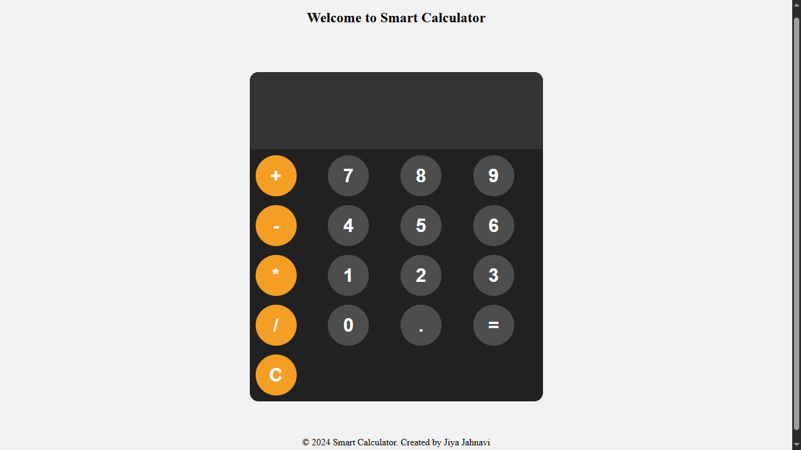

---

# 🧮 Calculator Website

A simple, responsive calculator built with HTML, CSS, and JavaScript to perform basic arithmetic operations with a sleek UI.

## 🌟 Features

* Basic operations: Addition, Subtraction, Multiplication, Division
* Responsive and clean UI
* Keyboard input support 

## 🚀 Live Demo

🔗 [Click here to view the website](https://calculatorjiyajahnavi.netlify.app/)

## 🛠️ Built With

* **HTML5**
* **CSS3**
* **JavaScript (ES6+)**

## 📁 Folder Structure

```
calculator-website/
│
├── index.html
├── style.css
├── index.js
└── assets/
    └── calculator-preview.png
```

## 📷 Screenshots

<div align="center">
  
  <p><b>🖼️ UI Preview</b></p>
</div>

## 💡 How to Use

1. Clone the repository:

   ```bash
   git clone https://github.com/your-username/calculator-website.git
   ```

2. Open `index.html` in your browser.

## 🙋‍♀️ Author

**Jiya Jahnavi**

* 🌐 [Portfolio](https://jiya-jahnavi-portfolio.netlify.app/)
* 💼 [LinkedIn](https://linkedin.com/in/jiya-jahnavi)
* 🐙 [GitHub](https://github.com/jiyajahnavi)

## ⭐️ Show Your Support

If you liked this project, give it a ⭐️ and feel free to fork it!

---
